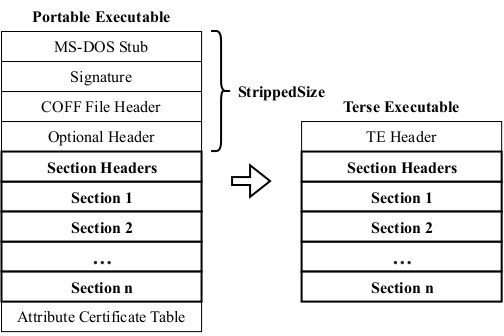

# Acidanthera UEFI Development Kit

AUDK is a fork of [EDK II project](https://github.com/tianocore/edk2) focused on security. 
The main goal of AUDK project is to bring the best practices of secure code development into firmware domain. 
These practices include (but are not limited to) static analysis, fuzzing, formal verification, 
code hardening through various compiler optimizations and codebase architectural refactoring.

[STATUS.md](STATUS.md) lists current states of the supported packages (toolchains, targets, CI supervision).

Stable branches in AUDK project are constructed by rebasing all the commits in master branch upon EDK II stable tag. 
Available stable branches: 
* [audk-stable-202211](https://github.com/acidanthera/audk/tree/audk-stable-202211) 
* [audk-stable-202302](https://github.com/acidanthera/audk/tree/audk-stable-202302) 
* [audk-stable-202305](https://github.com/acidanthera/audk/tree/audk-stable-202305) 
* [audk-stable-202311](https://github.com/acidanthera/audk/tree/audk-stable-202311) 
* [audk-stable-202405](https://github.com/acidanthera/audk/tree/audk-stable-202405) 

## Supported features
* [PE loader designed with formal methods](#pe-loader-designed-with-formal-methods) 
* [UEFI Executable File Format](#uefi-executable-file-format) 
* [ImageTool](#imagetool) 
* Ext4Pkg, FatPkg: Various improvements based on [Sydr](https://github.com/ispras/oss-sydr-fuzz) fuzzing results 
* [Introduced CpuArchLib to move the CPU Architectural initialization to DxeCore](https://github.com/tianocore/projects/issues/26) ([Bugzilla Bug 3223](https://bugzilla.tianocore.org/show_bug.cgi?id=3223)) 
* CI checks not only compilation results of various packages but also boot results of Windows 10 / Linux kernels for [OVMF](.github/workflows/build_x86.yaml) and [ArmVirtQemu](.github/workflows/build_arm.yaml) 
* Introduced [new image protection policy](MdePkg/MdePkg.dec#L2388-L2407), which forbids loading of unaligned images 
* Replaced [PE/COFF resource sections](https://github.com/tianocore/edk2/issues/9583) with a [single C struct](https://github.com/acidanthera/audk/blob/master/BaseTools/ImageTool/ImageTool.c#L24-L116)

## PE loader designed with formal methods

This branch demonstrates the integration of a new PE/COFF loader designed with the help of formal methods into the EDK II infrastructure.

### Introduction

The PE/COFF loader is one of the central components of the firmware core and its trust base. Every Image which is part of a UEFI system, including platform drivers from the primary firmware storage, Option ROMs from external hardware, and OS loaders from arbitrary storage, is verified and loaded by this library. Clearly it is a key component to ensure platform reliability and software compatibility, and can only be modified with great care. It also is an essential component for security technologies such as Secure Boot and Measured Boot.

Unfortunately, over the years, the current solution has been subject to bug reports affecting platform reliability, some of which have been unresolved to date. Please refer to the TianoCore BugZilla and especially discussions on the edk2-devel mailing list for further reading. Due to the incremental changes to the existing solution over the years, the state of a sound solution has been lost, and it has become a maintenance burden that is hard to fix and further advance incrementally. At the same time, the demand on not only tested but proven security has become more important in the recent times.

The usage of formal methods to design the new solution greatly helped restore the state of a truly sound solution, resolving many issues regarding inter-API guarantees and Image format validation. Many new abstractions have been introduced, external code has been centralized, and the overall flexibility has been improved, to hopefully aid developers to extend the codebase more easily in the future. Beyond that, the formal model ensures a high level of confidence that security-wise there have been no regressions, and there might even be potential improvements.

Please also refer to the new work-in-progress documentation available at [MdePkg/Library/BasePeCoffLib2/Documentation.md](MdePkg/Library/BasePeCoffLib2/Documentation.md)

### Further abstraction

The new solution has been implemented as a new library class in MdePkg. ``PeCoffLib2`` features a new API that allows for a more resilient and a more flexible caller design. Most notably, all Image operations have been integrated into the API design rather than the callers accessing the library context and duplicating certain work. ``PeCoffLib`` remains intact as deprecated API to support legacy code during the transition period.

To increase platform flexibility, a new layer of abstraction is introduced in the form of the library class ``UefiImageLib``, which can be found at [MdePkg/Include/Library/UefiImageLib.h](MdePkg/Include/Library/UefiImageLib.h). Currently, it is a subset of the APIs provided by ``PeCoffLib2`` that is expected to be compatible with most other common executable formats, plus a few convenience functions. As part of the proposal, the instance ``UefiImageLibPeCoff`` is provided, which is basically a shim for ``PeCoffLib2``. In the future, instances to support other file formats can be introduced without having to integrate them across the entire EDK II tree.

For security and code size optimization reasons, the ``UefiImageLib`` design is complicated.
To not expose FV-only UEFI image formats via, e.g., DxeCore to untrusted sources,
``UefiImageLib`` can be configured to support different UEFI image formats per source.

### Issues of the current solution
* High level of maintenance cost due to convoluted function contracts
* Error-prone design promoting the introduction of code bugs
* Multiple real-world bugs affecting reliability, some unaddressed for years
* A lot of duplicate caller-side code that decreases the flexibility of porting and integration (e.g. Image permissions in PEI)
* Dependency on Image re-parsing for production code

### Benefits of the new solution
* Fixes all known reported BugZilla tickets on PE/COFF loader reliability
* Formal methods increase confidence in a high level of reliability and security
* Improved design eases future maintenance and extension
* Architecture-independent Image processing (e.g. for emulation)
* Support for more granular Image section permissions (e.g. read-only)

### Benefits of the formal methods involved
* Complete proof arithmetic cannot overflow (excluding intentional modulo arithmetic)
* Mostly complete proof memory accesses are safe (requires axioms)
* Complete proof of Image format compliance verification
* Complete proof of Image loading
* Mostly complete proof of Image relocation (final memory state cannot be easily described)

### Further notes about the formal approach
* A snapshot of the new PE/COFF loader code will be provided with annotations and proving results
* The snapshot will not be current and updating the old code is out of the scope of this project, however the functional changes should be manageable to review
* We are currently investigating whether deploying the proving environment as a Docker container is feasible
* There may be aids to compare the updates over the last fully verified state (e.g. stripped versions of the code with diffs)
* If accepted, the new PE/COFF loader code should be developed further without updating the formal annotations, but with thorough review of important invariants and sufficient documentation

### Current progress, future goals, and further notes
* OVMF boots to Shell with SMM and Secure Boot enabled
* Linux EmulatorPkg boots
* Extended support for Image protection has been implemented
* FFS and DebugTable enhancements have been implemented
* Not all features have been implemented, e.g. RISC-V support
* There are unrelated changes present to help testing and validation
* Specified interfaces need adjustments (e.g. security architectural protocol)
* Some validation is still absent

### BZs fixed by integrating the new PE/COFF loader
* [Verify that loading images with <4k section alignment either succeeds or fails gracefully (Bugzilla Bug 1860)](https://github.com/tianocore/edk2-test/issues/222)
* [PE loader should zero out dest buffer on allocation (Bugzilla Bug 1999)](https://github.com/tianocore/edk2/issues/9757)
* [[PeCoffLib] Provide flexibility for platform to disable TE image support (Bugzilla Bug 2120)](https://github.com/tianocore/edk2/issues/9784)
* [DxeCore: No support for granular PE section permissions (Bugzilla Bug 3329)](https://github.com/tianocore/edk2/issues/10074)
* More to be added shortly...

### BZs easier to address by integrating the new PE/COFF loader
* [Enforce W^X design principles (Bugzilla Bug 3326)](https://github.com/tianocore/edk2/issues/10072)
* [Treat memory protection attributes separately (Bugzilla Bug 3331)](https://github.com/tianocore/edk2/issues/10075)
* More to be added shortly...

## UEFI Executable File Format

The Terse Executable (TE) format is a curious approach to reducing the size of PE files.
Essentially, it replaces the multi-layer Portable Executable (PE) image file header with a single, denser image file header.

However, the conversion does not fix the internal offsets — this must be done by the image file loading — and
it is unlikely to reduce the size of memory page-aligned execute-in-place (XIP) image files.
The simpler parsing properties of having only a single, simple image file header are contrasted by the complexity of
considering the shift in data offsets and the semantic change to the image address space.
For XIP files, the replacement of the PE image file header also shifts the addresses of all image segments.
To account for this, EDK II’s PeiCore has a workaround to apply the shift to the load address,
so that the image file header is technically misaligned, but the image segments are correctly aligned.
This is especially important when enforcing memory permissions during PEI.

We propose a novel executable file format ([UEFI Executable File Format](MdePkg/Library/BaseUeImageLib), [UE](https://github.com/mhaeuser/MastersThesis/tree/main)),
accompanied by a trivial digital signature scheme. (In our repository TE format is completely replaced with UE.)
Both help reduce the complexity of parsing and validation, while also encoding metadata much more efficiently than
the PE and the TE formats. They are specifically designed for UEFI firmware implementations and are explicitly not optimized
for the needs of modern operating systems. Compared to existing alternatives such as ELF and the Mach-O format,
the proposed alternative makes extensive use of encoding techniques to impose certain constraints on the metadata,
reducing the need for conformance validation.

## ImageTool

For compiler toolchain configurations based on GCC and Clang, EDK II generates ELF files in the first step.
To convert these into PE files, the TianoCore tool ``GenFw`` is used. It converts ELF image file sections to PE image file sections
while ignoring ELF image segments. Due to the great flexibility offered by ELF image file sections, conversion is done by using
custom static linking scripts to merge ELF image file sections as desired.
An undocumented detail of the EDK II build system is that all image files are generated as XIP, regardless of their phase or purpose.

The main architectural flaw of ``GenFw`` and [other TianoCore tools](BaseTools/Source/C) is code duplication, i.e.
instead of using standard library modules of the already existing packages in the repository, necessary source files (or functions)
are simply copied into the building directory of those tools.

We addressed that issue in our AUDK project greatly increasing code reuse among BaseTools and, in addition,
to make image file conversion easier to maintain, extend, and validate, we have replaced ``GenFw`` with ``ImageTool``.
[``ImageTool``](BaseTools/ImageTool) implements an approach based on an intermediate representation.
This allows input and output formats to be processed independently of each other.
At the same time, operations such as relocating an image became format-independent, contributing to improved extensibility.
Because we designed the intermediate representation to be semi-canonical, we were able to use it to reduce the validation of the output file
to parsing the input file and comparing the resulting intermediate representation to the original one.
