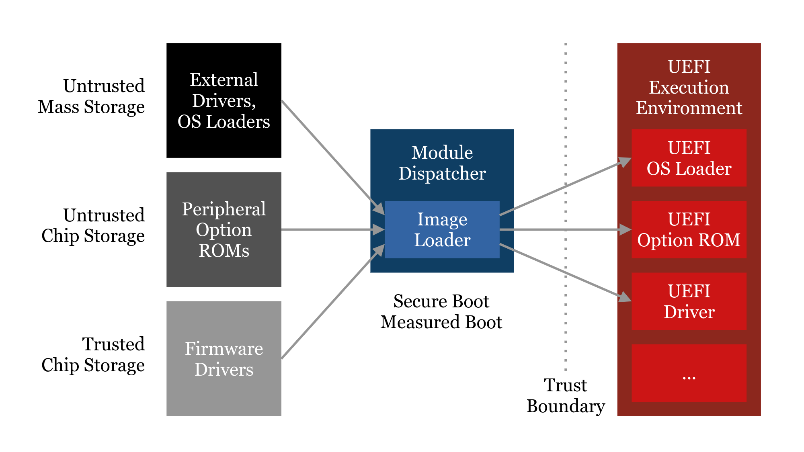

# Verified EDK II Image Loader

This branch demonstrates the integration of a new Image Loader designed with the help of formal methods into the EDK II infrastructure.

## Introduction

The Image Loader is one of the central components of the firmware core and the trust base. Every Image part of an UEFI system, including platform drivers from the primary firmware storage, Option ROMs from external hardware, and OS loaders from arbitrary storage, is verified and loaded by this library. Clearly it is a key component to ensure platform reliability and software compatibility, and can only be modified with great care. It also is an essential component for security technologies such as Secure Boot and Measured Boot.

Unfortunately, over the years, the current EDK II Image Loader has been subject to bug reports affecting platform reliability, some of which have been unresolved to date. Please refer to the TianoCore BugZilla and especially discussions on the edk2-devel mailing list for further reading. Due to the incremental changes to the existing solution over the years, the state of a sound solution has been lost, and it has become a maintenance burden that is hard to fix and further advance incrementally. At the same time, the demand on not only tested but proven security has become more important in the recent times.

The usage of formal methods to design the new solution greatly helped restore the state of a truly sound solution, resolving many issues regarding inter-API guarantees and Image format validation. Many new abstractions have been introduced, external code has been centralized, and the overall flexibility has been improved, to hopefully aid developers to extend the codebase more easily in the future. Beyond that, the formal model ensures a high level of confidence that security-wise there have been no regressions, and there might even be potential improvements.

## Issues of the current solution
* High level of maintenance cost due to convoluted function contracts
* Error-prone design promoting the introduction of code bugs
* Multiple real-world bugs affecting reliability, some unaddressed for years

## Benefits of the new solution
* Fixes all known reported BZs on Image Loader reliability
* Formal methods increase confidence in a high level of reliability and security
* Improved design eases future maintenance and extension
* Architecture-independent Image processing (e.g. for emulation)
* Support for more granular Image section permissions (e.g. read-only)

## Benefits of the formal methods involved
* Complete proof arithmetic cannot overflow (excluding intentional modulo arithmetic)
* Mostly complete proof memory accesses are safe (requires axioms)
* Complete proof of Image format compliance verification
* Complete proof of Image loading
* Mostly complete proof of Image relocation (final memory state cannot be easily described)

## Further notes about the formal approach
* A snapshot of the new Image Loader code will be provided with annotations and proving results
* The snapshot will not be current and updating the old code is out of the scope of this project, however the functional changes are trivial
* There will be aids to compare the updates over the last fully verified state (e.g. stripped versions of the code with diffs)
* If accepted, the new Image Loader code should be developed further without updating the formal annotations, but with thorough review of important invariants and sufficient documentation
* We are currently investigating whether deploying the proving environment as a Docker container is feasible

## Current progress, future goals, and further notes
* OVMF boots to Shell with SMM and Secure Boot enabled
* Extended support for Image protection has been implemented
* Not all packages build or have been fully ported
* Not all features have been implemented, e.g. debug support and RISC-V
* Not all security requirements are met, i.e. due to insufficient APIs
* Not all problematic coding conventions have been fully resolved
* There are unrelated changes present to help testing and validation
* Build compatibility for out-of-tree packages is still absent
* We intend to provide thorough design documentation

## BZs fixed by integrating the new Image Loader
* https://bugzilla.tianocore.org/show_bug.cgi?id=1999
* https://bugzilla.tianocore.org/show_bug.cgi?id=3329
* https://bugzilla.tianocore.org/show_bug.cgi?id=1860
* https://bugzilla.tianocore.org/show_bug.cgi?id=2120
* More to be added shortly...

## BZs easier to address by integrating the new Image Loader
* https://bugzilla.tianocore.org/show_bug.cgi?id=3326
* https://bugzilla.tianocore.org/show_bug.cgi?id=3331
